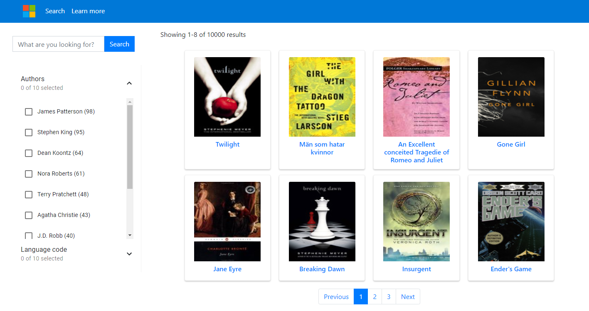

# Add search to a web app in JavaScript

This JavaScript code sample builds a website to search through a catalog of books. It includes two programs. First, the bulk import program creates and loads a search index containing books and authors. The second program creates a web site that's hosted as an Azure Static Web App resource. The second program uses an Azure Function to make calls to the search index.

This code leverages the [Azure SDK for Javascript/Typescript](https://github.com/Azure/azure-sdk-for-js/tree/master/sdk/search/search-documents/) and [Azure Static Web Apps](https://aka.ms/swadocs) to make it easy to get up and running with a simple web application. The web front-end includes a search page with faceted navigation, a search bar for free form search and suggested queries, and tabbed page results.

This README is an shortened version of the [full tutorial](https://aka.ms/search-website-tutorial). 

Related resources:

* [Demo](https://victorious-beach-0ab88b51e.azurestaticapps.net/)
* [Tutorial](https://aka.ms/search-website-tutorial)



## Prerequisites

* [Node.js](https://nodejs.org/)
* [Git](https://git-scm.com/downloads)
* [Visual Studio Code](https://code.visualstudio.com/Download)
* [Azure AI Search](https://docs.microsoft.com/azure/search/search-create-service-portal)
* [Query API key for Azure AI Search](https://learn.microsoft.com/azure/search/search-security-api-keys#find-existing-keys)
* [Azure Functions extension for Visual Studio Code](https://marketplace.visualstudio.com/items?itemName=ms-azuretools.vscode-azurefunctions&WT.mc_id=shopathome-github-jopapa)
* [Azure Functions Core Tools](https://docs.microsoft.com/azure/azure-functions/functions-run-local?WT.mc_id=shopathome-github-jopapa)

## Download sample repository

1. In a terminal, use git to fork and clone this repository to your local computer:

    ```bash
    git clone https://github.com/Azure-Samples/azure-search-javascript-samples
    ```

1. Open that local directory in Visual Studio Code.

## Run bulk import to create and load the search index

1. Open the `./search-website/bulk-insert/bulk_insert_books.js`.
1. Download the [books.csv](https://raw.githubusercontent.com/zygmuntz/goodbooks-10k/master/books.csv) to the same directory as the `bulk_insert_books.js` file.
1. Replace the following variables in the `bulk_insert_books.js` with your own values to authenticate with the Azure Search SDK:

    * YOUR-SEARCH-RESOURCE-NAME
    * YOUR-SEARCH-ADMIN-KEY

1. Open a terminal in VS Code from this directory by selecting the directory, then selecting **Open Integrated Terminal**.

1. Install the project dependencies:

   ```bash
   npm install
   ```

1. Run the bulk import script:

    ```bash
    npm start
    ```

## Create a Static Web App in Visual Studio Code

1. Select **Azure** from the Activity Bar, then open **Resources** from the Side bar. 

1. Right-click **Static Web Apps** and then select **Create Static Web App (Advanced)**.

1. If you see a pop-up window in VS Code asking which branch you want to deploy from, select the default branch, usually **master** or **main**. 

    This setting means only changes you commit to that branch are deployed to your static web app. 

1. If you see a pop-up window asking you to commit your changes, do not do this. The secrets from the bulk import step should not be committed to the repository. 

    To rollback the changes, in VS Code select the Source Control icon in the Activity bar, then select each changed file in the Changes list and select the **Discard changes** icon.

1. Follow the prompts to provide the following information:

    |Prompt|Enter|
    |--|--|
    |Enter the name for the new Static Web App.|Create a unique name for your resource. For example, you can prepend your name to the repository name such as, `joansmith-azure-search-javascript-samples`. |
    |Select a resource group for new resources.|Use the resource group you created for this tutorial.|
    |Select a SKU| Select the free SKU for this tutorial.|
    |Choose build preset to configure default project structure.|Select **Custom**|
    |Select the location of your application code|`search-website`<br><br>This is the path, from the root of the repository, to your Azure Static web app. |
    |Select the location of your Azure Function code|`search-website/api`<br><br>This is the path, from the root of the repository, to your Azure Function app. |
    |Enter the path of your build output...|`build`<br><br>This is the path, from your Azure Static web app, to your generated files.|
    |Select a location for new resources.|Select a region close to you.|

1. The resource is created, select **Open Actions in GitHub** from the Notifications. This opens a browser window pointed to your forked repo. 

    The list of actions indicates your web app, both client and functions, were successfully pushed to your Azure Static Web App. 

    Wait until the build and deployment complete before continuing. This may take a minute or two to finish.

1. Get the query key for Azure AI Search. Keep this query key, you will need to use it in the next section. The query key gives you read access to query your index. 

## Add configuration settings in Azure portal

The Azure Function app won't return Search data until the Search secrets are in settings. 

1. Select **Azure** from the Activity Bar. 
1. Right-click on your Static web app resource then select **Open in Portal**.
1. Select **Configuration** then select **+ Add**.

1. Add each of the following settings:

    |Setting|Your Search resource value|
    |--|--|
    |SearchApiKey|Your Search query key|
    |SearchServiceName|Your Search resource name|
    |SearchIndexName|`good-books`|
    |SearchFacets|`authors*,language_code`|

    Azure AI Search requires different syntax for filtering collections than it does for strings. Add a `*` after a field name to denote that the field is of type `Collection(Edm.String)`. This allows the Azure Function to add filters correctly to queries.

1. Select **Save** to save the settings. 
1. Return to VS Code. 
1. Refresh your Static web app to see the Static web app's application settings. 

## Use search in your Static web app

1. In Visual Studio Code, open the [Activity bar](https://code.visualstudio.com/docs/getstarted/userinterface), and select the Azure icon.
1. In the Side bar, **right-click on your Azure subscription** under the `Static web apps` area and find the Static web app you created for this tutorial.
1. Right-click the Static Web App name and select **Browse site**.
1. Select **Open** in the pop-up dialog.
1. In the website search bar, enter a search query such as `code`, _slowly_ so the suggest feature suggests book titles. Select a suggestion or continue entering your own query. Press enter when you've completed your search query. 
1. Review the results then select one of the books to see more details. 
