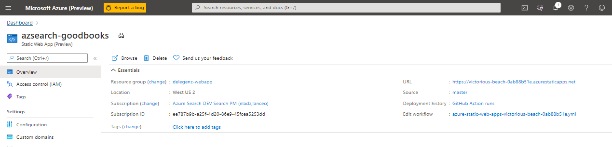

# Azure Cognitive Search UI

This sample is a React template for [Azure Cognitive Search](https://docs.microsoft.com/en-us/azure/search/search-what-is-azure-search). It leverages the [Azure SDK for Javascript/Typescript](https://github.com/Azure/azure-sdk-for-js/tree/master/sdk/search/search-documents/) and [Azure Static Web Apps](https://aka.ms/swadocs) to make it easy to get up and running with a simple web application. It includes a search page with faceted navigation, a search bar for free form search and suggested queries, and tabbed page results.

This README is an shortened version of the [full tutorial](https://aka.ms/search-website-tutorial). 

Related resources: 
* [Demo](https://victorious-beach-0ab88b51e.azurestaticapps.net/)
* [Tutorial](https://aka.ms/search-website-tutorial)


You can easily deploy the sample onto Azure or run it locally by following the steps below.

## Running the application locally

To run the sample locally, follow the steps below.

### Prerequisites

- A GitHub account
- A Cognitive Search resource using the `Free` pricing tier. This can be created in VS Code with the [Cognitive Search extention](https://marketplace.visualstudio.com/items?itemName=ms-azuretools.vscode-azurecognitivesearch).  Copy following resources values before continuing:
    - YOUR-SEARCH-RESOURCE-NAME
    - YOUR-SEARCH-ADMIN-KEY - used in bulk import script
    - YOUR-SEARCH-QUERY-KEY - used in Function api 
- [Node.js and Git](https://nodejs.org/)
- [Visual Studio Code](https://code.visualstudio.com/?WT.mc_id=shopathome-github-jopapa) installed
    - [Static Web app extension](https://marketplace.visualstudio.com/items?itemName=ms-azuretools.vscode-azurestaticwebapps) installed
    - [Cognitive Search extention](https://marketplace.visualstudio.com/items?itemName=ms-azuretools.vscode-azurecognitivesearch)

### Download sample repository

1. In a terminal, use git to clone (or Fork and Clone) this repository to your local computer:

    ```bash
    git clone https://github.com/Azure-Samples/azure-search-javascript-samples
    ```

1. Open that local directory in Visual Studio Code.

### Run bulk import to the Search Index

1. Open the `./search-website/bulk-insert/bulk_insert_books.js`.
1. Download the [books.csv](https://raw.githubusercontent.com/zygmuntz/goodbooks-10k/master/books.csv) to the same directory as the `bulk_insert_books.js` file.
1. Replace the following variables in the `bulk_insert_books.js` with your own values to authenticate with the Azure Search SDK:

    * YOUR-SEARCH-RESOURCE-NAME
    * YOUR-SEARCH-ADMIN-KEY

1. Open a terminal in VS Code from this directory by selecting the directory, then selecting **Open Integrated Terminal**.
 
1. Install the project dependencies:

   ```bash
   npm install
   ```

1. Run the bulk import script:

    ```bash
    npm start
    ```

### Running the React client

1. In your terminal, change into the `search-website` base directory:

    ```bash
    cd ..
    ```

1. Install the project dependencies:

   ```bash
   npm install
   ```

1. Run the front-end project in the browser (automatically opens a browser window).

   ```bash
   npm start
   ```

    This app won't work until the Azure Function API in the next section is also configured and running. 

### Setup to Function API application

1. Find the `local.settings.json.rename` in your downloaded directory for this repo. It is in `./search-website/api/`.
1. Rename the `local.settings.json.rename` file to `local.settings.json`, removing the `rename` portion of the file name.

    The `local.settings.json` file holds all of the keys that the application needs.
    
1. Replace the following values with your own values:

    * YOUR-SEARCH-RESOURCE-NAME
    * YOUR-SEARCH-QUERY-KEY

  
    ```json
    {
      "IsEncrypted": false,
      "Values": {
        "AzureWebJobsStorage": "",
        "FUNCTIONS_WORKER_RUNTIME": "node",
        "SearchApiKey": "YOUR-SEARCH-QUERY-KEY",
        "SearchServiceName": "YOUR-SEARCH-RESOURCE-NAME",
        "SearchIndexName": "good-books",
        "SearchFacets": "authors*,language_code"
      }
    }
    ```

### Install Function dependencies

Install the [Azure Function Core Tools](https://docs.microsoft.com/azure/azure-functions/functions-run-local?tabs=linux%2Ccsharp%2Cbash#v2).

### Running the Function API

1. Open a second integrated terminal for the `/search-website/api` directory inside your downloaded directory of this repository on your local computer.

1. Install the project dependencies:

   ```bash
   npm install
   ```

1. Run the api project.

   ```bash
   npm start
   ```

## Deploying this sample

### Creating the web app

1. Next, you need to create a Static Web App in the Azure portal. Click the button below to create one:

    [](https://portal.azure.com/?feature.customportal=false#create/Microsoft.StaticApp)

    This will walk you through the process of creating the web app and connecting it to your GitHub repo.

    > [!NOTE]
    > Remember the search web app is in a subfolder of the repository. 

1. After connecting to the repo, you'll be asked to include some build details. Set the Build Presets to `React` and then leave the other default values:

    

1. Once you create the static web app, it will automatically deploy the web app to a URL you can find within the portal.

    

1. The last thing you need to do is select **Configuration** and then edit the application settings to add the following name/value pairs of credentials from `local.settings.json`. 

    ```json
    "SearchApiKey": "YOUR-SEARCH-QUERY-KEY",
    "SearchServiceName": "YOUR-SEARCH-RESOURCE-NAME",
    "SearchIndexName": "good-books",
    "SearchFacets": "authors*,language_code"
    ```

    It may take a few minutes for this blade to become available in the portal.

    

    Additional documentation can be found in the [docs folder](./docs).
